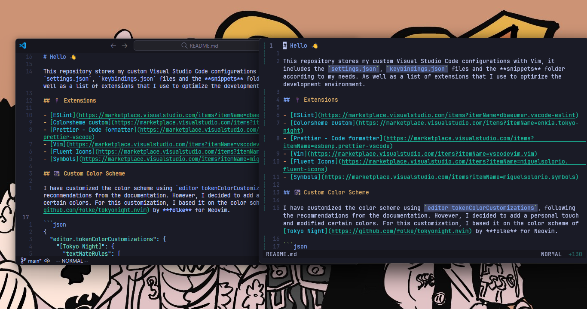

# Bienvenido 👋

[English version](./README.md)

Este repositorio almacena mis configuraciones personalizadas de Visual Studio Code con Vim, incluye los archivos `settings.json`, `keybindings.json` y la carpeta de **snippets** según mis necesidades. Así como una lista de extensiones que utilizo para optimizar el entorno de desarrollo.



## 🔌 Extensiones

- [ESLint](https://marketplace.visualstudio.com/items?itemName=dbaeumer.vscode-eslint)
- [Colorsheme custom](https://marketplace.visualstudio.com/items?itemName=enkia.tokyo-night)
- [Prettier - Formateador de código](https://marketplace.visualstudio.com/items?itemName=esbenp.prettier-vscode)
- [Vim](https://marketplace.visualstudio.com/items?itemName=vscodevim.vim)
- [Fluent Icons](https://marketplace.visualstudio.com/items?itemName=miguelsolorio.fluent-icons)
- [Symbols](https://marketplace.visualstudio.com/items?itemName=miguelsolorio.symbols)

## 🌃 Esquema de color personalizado

He realizado una personalización del esquema de color utilizando `editor.tokenColorCustomizations`, siguiendo las recomendaciones de la documentación. No obstante, decidí añadir un toque personal y modifiqué ciertos colores. Para esta personalización, me basé en el esquema de color de [Tokyo Night](https://github.com/folke/tokyonight.nvim) de **folke** para Neovim.

```json
{
  "editor.tokenColorCustomizations": {
    "[Tokyo Night]": {
      "textMateRules": [
        {
          "scope": ["entity.name.tag", "meta.tag.metadata.title.start"],
          "settings": {
            "foreground": "#bb9af7"
          }
        }
      ]
    }
  }
}
```

He dedicado esfuerzos para garantizar que los colores en Visual Studio Code y Neovim sean lo más parecidos posible. Hasta el momento, he conseguido esto para los archivos `html`, `css`, `javascript`, `lua`, `markdown`, `json` y algunos otros, a los cuales planeo añadir más en el futuro. A continuación, podrás apreciar algunas capturas de pantalla o GIFs que muestran el resultado de mi personalización.

### HTML


### CSS


### JavaScript


### JSON


### Lua


## ⚙️ Opciones de configuración

### VSCode

- `"editor.defaultFormatter"`: establece el formateador predeterminado
- `"editor.fontFamily"`: establece el tipo de fuente para el editor
- `"editor.cursorSurroundingLines"`: establece el número de líneas adicionales para mostrar alrededor del cursor
- `"editor.inlineSuggest.enabled"`: habilita las sugerencias de código en línea mientras escribes
- `"editor.suggest.insertMode"`: configura el comportamiento de las sugerencias de código cuando se inserta el texto sugerido
- `"editor.suggestFontSize"`: establece el tamaño de fuente para las sugerencias de código
- `"editor.guides.bracketPairs"`: muestra guías verticales para resaltar pares de corchetes
- `"editor.bracketPairColorization.enabled"`: habilita la coloración de pares de corchetes
- `"editor.lineNumbers"`: muestra números de línea relativos a la posición del cursor
- `"editor.wordWrap"`: activa el ajuste de línea automático
- `"editor.detectIndentation"`: desactiva la detección de sangría automática
- `"typescript.preferences.importModuleSpecifier"`: configura cómo se importan los módulos en TypeScript
- `"typescript.updateImportsOnFileMove.enabled"`: habilita la actualización de las importaciones de TypeScript al mover archivos
- `"editor.tabSize"`: establece el tamaño de la tabulación
- `"emmet.includeLanguages"`: habilita las características de Emmet para el lenguaje de programación JavaScript al trabajar en archivos HTML
- `"files.autoSave"`: establece la opción de auto-guardado
- `"editor.fontLigatures"`: habilita las ligaduras tipográficas
- `"editor.rulers"`: desactiva las guías verticales
- `"editor.renderWhitespace"`: oculta el espacio en blanco
- `"editor.smoothScrolling"`: habilita el desplazamiento suave
- `"editor.stickyScroll.enabled"`: desactiva el desplazamiento pegajoso
- `"explorer.confirmDelete"`: desactiva la confirmación de eliminación de archivos en el Explorador de archivos
- `"explorer.confirmDragAndDrop"`: desactiva la confirmación al arrastrar y soltar archivos en el Explorador de archivos
- `"editor.guides.indentation"`: desactiva las guías de sangría
- `"editor.linkedEditing"`: habilita la edición vinculada, que permite editar símbolos similares simultáneamente
- `"editor.cursorBlinking"`: establece el estilo de parpadeo del cursor
- `"editor.minimap.enabled"`: desactiva el minimapa
- `"editor.selectionHighlight"`: desactiva el resaltado de selección de texto
- `"editor.wordSeparators"`: define los caracteres que se consideran separadores de palabras al hacer selecciones de palabras
- `"window.menuBarVisibility"`: establece la visibilidad de la barra de menú para que aparezca solo cuando se pulsa la tecla Alt
- `"workbench.editor.showTabs"`: muestra las pestañas de los archivos abiertos en la parte superior del espacio de trabajo
- `"window.titleBarStyle"`: establece el estilo de la barra de título de la ventana
- `"workbench.editor.labelFormat"`: establece el formato de etiqueta para las pestañas en los archivos abiertos
- `"[json]"`: configuración específica para archivos JSON, pero no contiene configuraciones adicionales
- `"[html]"`: configuración específica para archivos HTML, utilizando el formateador "vscode.html-language-features"
- `"window.title"`: establece el título de la ventana (Por ejemplo: su nombre)
- `"workbench.layoutControl.enabled"`: desactiva el diseño controlado en el espacio de trabajo
- `"window.restoreWindows"`: configura cómo se deben restaurar las ventanas abiertas al inicio
- `"window.commandCenter"`: habilita el Centro de comandos en la ventana
- `"symbols.hidesExplorerArrows"`: desactiva las flechas de expansión en el Explorador de archivos

> 💡 Opté por configurar `"editor.formatOnSave": false` debido a que, en ocasiones, prefiero que no se realice un formateo automático al guardar. Por esta razón, asigné `<leader>fd` para utilizarlo cuando necesite formatear el documento.

### Vim

- `"vim.foldfix": true`: corrige el error de doblado al usar Ctrl+Shift+[ (Doblado) y Ctrl+Shift+] (Desdoblado)
- `"vim.easymotion": true`: facilita la navegación rápida en el texto
- `"vim.incsearch": true`: resalta los resultados de búsqueda a medida que escribes
- `"vim.useSystemClipboard": true`: permite el uso del portapapeles del sistema
- `"vim.useCtrlKeys": true`: habilita el uso de teclas de control para comandos específicos
- `"vim.hlsearch": true`: habilita la resaltado de búsqueda
- `"vim.normalModeKeyBindingsNonRecursive"`: define combinaciones de teclas en modo normal

### Configuración de Vim en VSCode

Con esta configuración, mi objetivo es que los usuarios de vim/neovim se sientan familiarizados, facilitando así el proceso de migración.
He intentado añadir comentarios en cada mapeado o combinación de teclas, correspondientes a sus diferentes modos.

#### Modos de Vim

- Modo normal (`vim.normalModeKeyBindings`)
- Modo normal no recursivo(`vim.insertModeKeyBindings`)
- Modo inserción (`vim.insertModeKeyBindings`)
- Modo Visual (`vim.visualModeKeyBindings`)

### Prettier

Las siguientes tres configuraciones están dedicadas para JavaScript, TypeScript y React:

- `"semi"`: indica que no se añaden puntos y comas al final de las oraciones
- `"singleQuote"`: usa comillas simples en lugar de comillas dobles para las cadenas de texto
- `"trailingComma"`: no añade comas al final de las listas y objetos
- `"htmlWhitespaceSensitivity"`: ignora los espacios en blanco en los archivos HTML al formatearlos.

> 📝 Esta configuración es solo una base y puedes modificarla a tu gusto con total libertad. ¡No dudes en experimentar y personalizarla para que se adapte a tus necesidades! 💻
