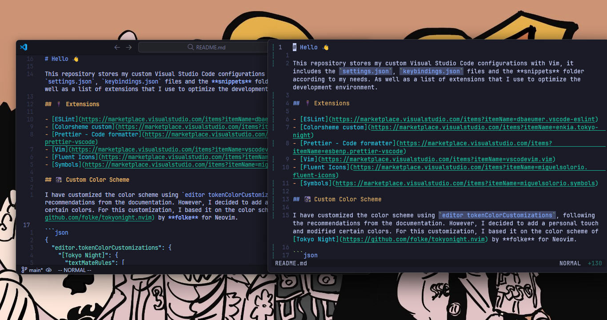
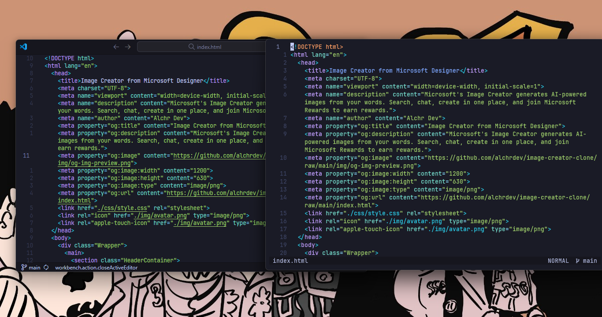
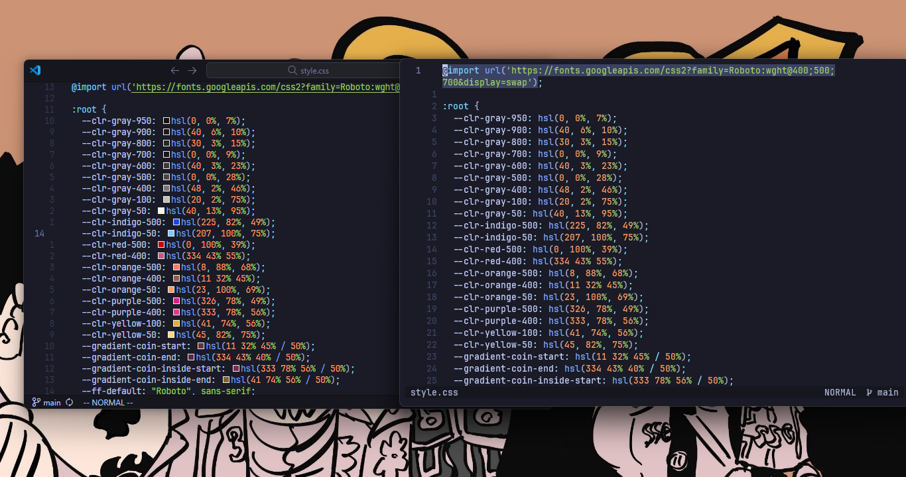
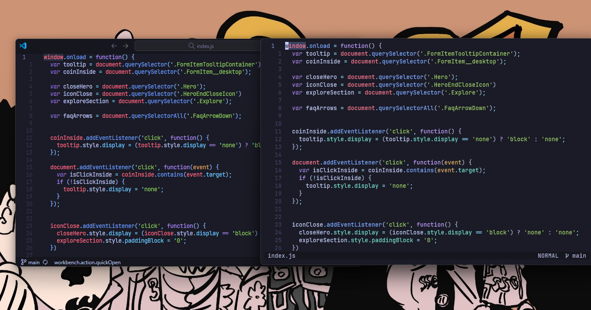
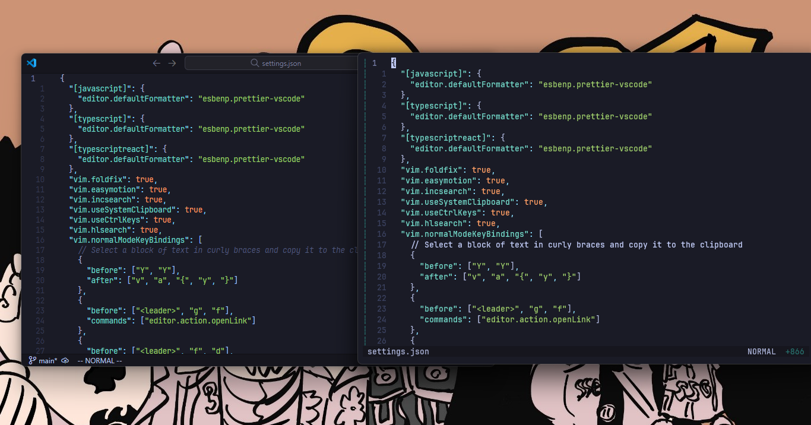
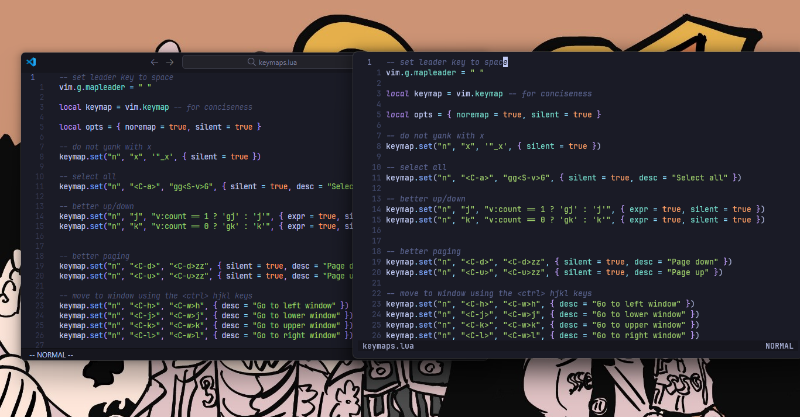

# Hello 👋

[Spanish version](./README.es.md)

This repository stores my custom Visual Studio Code configurations with Vim, it includes the `settings.json`, `keybindings.json` files and the **snippets** folder according to my needs. As well as a list of extensions that I use to optimize the development environment.



## 🔌 Extensions

- [ESLint](https://marketplace.visualstudio.com/items?itemName=dbaeumer.vscode-eslint)
- [Colorsheme custom](https://marketplace.visualstudio.com/items?itemName=enkia.tokyo-night)
- [Prettier - Code formatter](https://marketplace.visualstudio.com/items?itemName=esbenp.prettier-vscode)
- [Vim](https://marketplace.visualstudio.com/items?itemName=vscodevim.vim)
- [Fluent Icons](https://marketplace.visualstudio.com/items?itemName=miguelsolorio.fluent-icons)
- [Symbols](https://marketplace.visualstudio.com/items?itemName=miguelsolorio.symbols)

## 🌃 Custom Color Scheme

I have customized the color scheme using `editor tokenColorCustomizations`, following the recommendations from the documentation. However, I decided to add a personal touch and modified certain colors. For this customization, I based it on the color scheme of [Tokyo Night](https://github.com/folke/tokyonight.nvim) by **folke** for Neovim.

```json
{
  "editor.tokenColorCustomizations": {
    "[Tokyo Night]": {
      "textMateRules": [
        {
          "scope": ["entity.name.tag", "meta.tag.metadata.title.start"],
          "settings": {
            "foreground": "#bb9af7"
          }
        }
      ]
    }
  }
}
```

I have dedicated efforts to ensure that the colors in Visual Studio Code and Neovim are as similar as possible. So far, I have achieved this for `html`, `css`, `javascript`, `lua`, `markdown`, `json` files, and a few others, to which I plan to add more in the future. Below, you will be able to appreciate some screenshots or GIFs that show the result of my customization.

### HTML



### CSS



### JavaScript



### JSON



### Lua



## ⚙️ Configuration options

### VSCode

- `"editor.defaultFormatter"`: set default formatter
- `"editor.fontFamily"`: set the font type for the editor
- `"editor.cursorSurroundingLines"`: sets the number of additional lines to display around the cursor
- `"editor.inlineSuggest.enabled"`: enables inline code hints as you type
- `"editor.suggest.insertMode"`: configures the behavior of code hints when suggested text is inserted.
- `"editor.suggestFontSize"`: sets the font size for code suggestions
- `"editor.guides.bracketPairs"`: displays vertical guides to highlight pairs of brackets
- `"editor.bracketPairColorization.enabled"`: enables colorization of bracket pairs
- `"editor.lineNumbers"`: displays line numbers relative to cursor position
- `"editor.wordWrap"`: turn on automatic line wrapping
- `"editor.detectIndentation"`: turn off automatic indentation detection
- `"typescript.preferences.importModuleSpecifier"`: configures how modules are imported into TypeScript
- `"typescript.updateImportsOnFileMove.enabled"`: enables updating of TypeScript imports when moving files.
- `"editor.tabSize"`: set the tab size
- `"emmet.includeLanguages"`: enables Emmet features for the JavaScript programming language when working on HTML files
- `"files.autoSave"`: set the auto-save option
- `"editor.fontLigatures"`: enable typographic ligatures
- `"editor.rulers"`: disables vertical guides
- `"editor.renderWhitespace"`: hide white space
- `"editor.smoothScrolling"`: enables smooth scrolling
- `"editor.stickyScroll.enabled"`: turn off sticky scrolling
- `"explorer.confirmDelete"`: turn off file deletion confirmation in File Explorer
- `"explorer.confirmDragAndDrop"`: turn off confirmation when dragging and dropping files in File Explorer
- `"editor.guides.indentation"`: turn off indentation guides
- `"editor.linkedEditing"`: enables linked editing, which allows similar symbols to be edited simultaneously
- `"editor.cursorBlinking"`: set the cursor blink style
- `"editor.minimap.enabled"`: disable the minimap
- `"editor.selectionHighlight"`: turn off text selection highlighting
- `"editor.wordSeparators"`: defines the characters that are considered word breakers when making word selections
- `"window.menuBarVisibility"`: set the visibility of the menu bar to appear only when the Alt key is tapped.
- `"workbench.editor.showTabs"`: displays the tabs for open files at the top of the workspace
- `"window.titleBarStyle"`: set the style of the window's title bar
- `"workbench.editor.labelFormat"`: set the label format for tabs in open files
- `"[json]"`: specific settings for JSON files, but do not contain additional settings.
- `"[html]"`: specific configuration for HTML files, using the "vscode.html-language-features" formatter.
- `"window.title"`: sets the title of the window (For example: its name)
- `"workbench.layoutControl.enabled"`: disables controlled layout in the workspace
- `"window.restoreWindows"`: configures how open windows should be restored at startup
- `"window.commandCenter"`: enable the Command Center in the window
- `"symbols.hidesExplorerArrows"`: turn off the expansion arrows in File Explorer

> 💡 I chose to set `"editor.formatOnSave": false` because sometimes I prefer not to have automatic formatting on save. For this reason, I assigned `<leader>fd` to use it when I need to format the document.

### Vim

- `"vim.foldfix": true`: fixes the bend error when using Ctrl+Shift+[ (Folded) and Ctrl+Shift+] (Unfold)
- `"vim.easymotion": true`: facilitates quick navigation in text
- `"vim.incsearch": true`: highlight search results as you type
- `"vim.useSystemClipboard": true`: allows use of the system clipboard
- `"vim.useCtrlKeys": true`: enables the use of control keys for specific commands
- `"vim.hlsearch": true`: enables search highlighting
- `"vim.normalModeKeyBindingsNonRecursive"`: define key combinations in normal mode

### Vim Configuration in VSCode

With this configuration, my goal is for vim/neovim users to feel familiar, thus facilitating the migration process. I have tried to add comments on each mapping or key combination, corresponding to their different modes.

#### Vim Modes

- Normal mode (`vim.normalModeKeyBindings`)
- Non-recursive normal mode (`vim.insertModeKeyBindings`)
- Insert mode (`vim.insertModeKeyBindings`)
- Visual mode (`vim.visualModeKeyBindings`)

### Prettier

The following three settings are dedicated for JavaScript, TypeScript, and React:

- `"semi"`: indicates that semicolons are not added at the end of sentences
- `"singleQuote"`: use single quotes instead of double quotes for strings
- `"trailingComma"`: do not add commas to the end of lists and objects
- `"htmlWhitespaceSensitivity"`: ignore white spaces in HTML files when formatting them.

> 📝: This configuration is only a base and you can modify it to your liking with total freedom. ¡Do not hesitate to experiment and customize it to suit your needs! 💻
